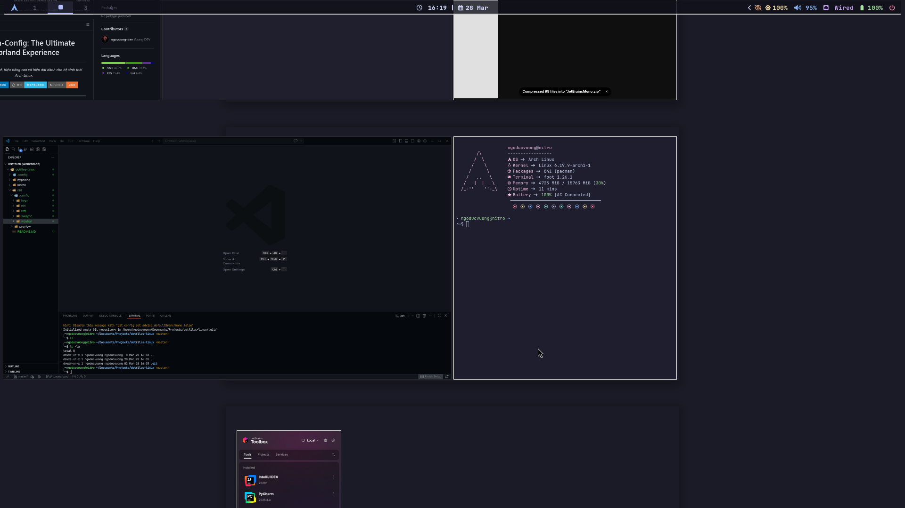
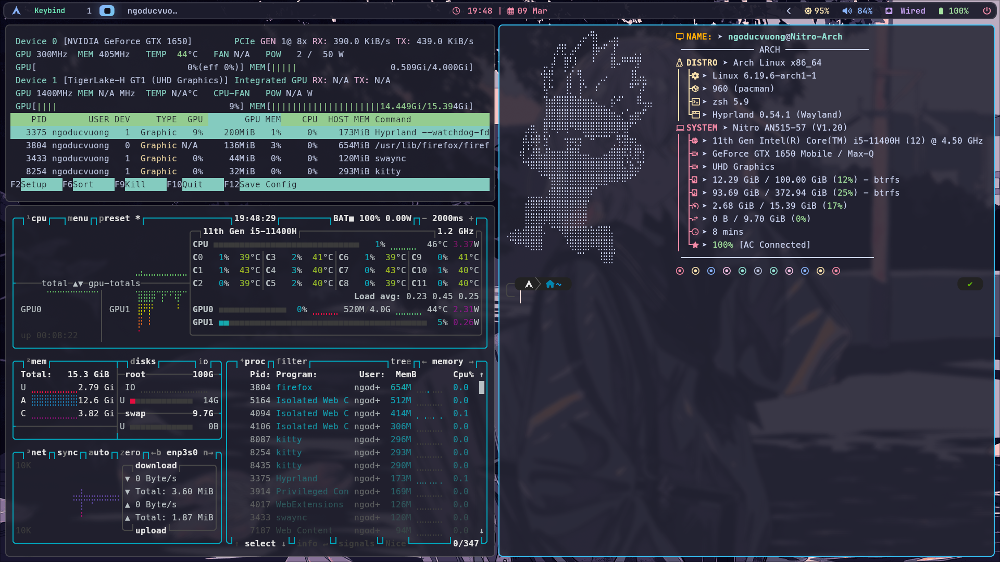

# vuongngo/dotfiles

**My Arch Linux dotfiles** — managed with GNU Stow for reproducibility and modularity.

Focused on a clean, productive, and reliable daily driver using **Niri** (primary) and **Hyprland** (secondary) on Arch Linux.

## 🖼️ Previews

### Niri (Primary Window Manager)

<div align="center">
  
  <p><em>Scrollable tiling Wayland compositor with clean interface</em></p>
</div>

### Hyprland (Secondary Window Manager)

<div align="center">
  
  <p><em>Feature-rich Wayland compositor with dynamic tiling</em></p>
</div>

## ✨ Highlights & Key Features

- **Modular structure**: Separate folders for common configs, Niri, and Hyprland — easy to maintain and extend
- **Reproducible setup**: One-command installation using GNU Stow — ensures consistent environment across machines
- **Minimal & performant**: Optimized for Wayland, tiling workflow, and system administration tasks — low resource usage
- **System Engineer mindset**: Clean organization, version-controlled configs, and automation-ready (scripts, backup, switch WM)
- **Wayland-native**: Full Wayland support with modern protocols for better performance and security
- **Tiling workflow**: Efficient window management for productivity and multitasking
- **Customizable**: Extensive configuration options for personalization

This repository demonstrates my ability to manage complex configurations as code — a core skill for Infrastructure as Code (IaC), automation, and reliable system design.

## 🛠️ Tech Stack

[](https://archlinux.org/)
[](https://github.com/niri-wm/niri)
[](https://hyprland.org/)
[](https://github.com/Alexays/Waybar)
[](https://github.com/davatorium/rofi)
[](https://codeberg.org/dnkl/foot)
[](https://neovim.io/)

- **OS**: Arch Linux (rolling release)
- **Window Manager**:
  - Primary: [Niri](https://github.com/niri-wm/niri) — Scrollable tiling Wayland compositor
  - Secondary: [Hyprland](https://hyprland.org/) — Dynamic tiling Wayland compositor
- **Status Bar**: [waybar](https://github.com/Alexays/Waybar) — Highly customizable Wayland bar
- **Launcher**: [rofi](https://github.com/davatorium/rofi) — Window switcher, application launcher and dmenu replacement
- **Notifications**: [swaync](https://github.com/ErikReider/SwayNotificationCenter) — Notification daemon for Wayland
- **Terminal**: [foot](https://codeberg.org/dnkl/foot) / [kitty](https://sw.kovidgoyal.net/kitty/) — Modern terminal emulators
- **Shell**: zsh / bash with custom configurations
- **Editor**: [neovim](https://neovim.io/) — Hyperextensible Vim-based text editor
- **Other**: bira (zsh theme), Git, Docker-ready environment

## 📁 Repository Structure

```bash
vuongngo/dotfiles/
├── README.MD                  # This file
├── .config/                   # Global shared configurations
│   ├── MangoHud/              # GPU overlay utility configs
│   ├── fastfetch/             # System information fetcher config
│   ├── foot/                  # Terminal emulator (Wayland-native)
│   ├── kitty/                 # GPU-based terminal emulator alternative
│   ├── nvim/                  # Neovim editor configs
│   ├── rofi/                  # Application launcher & menu configs
│   ├── clean.sh               # Cleanup script
│   ├── code-flags.conf        # VS Code flags configuration
│   └── electron-flags.conf    # Electron flags configuration
├── hyprland/                  # Hyprland window manager configs
│   ├── .config/               # Hyprland-specific settings
│   └── preview/               # Preview screenshots
├── niri/                      # Niri window manager configs (primary)
│   ├── .config/               # Niri KDL configuration files
│   └── preview/               # Preview screenshots
├── install/                   # Installation scripts
│   ├── install_bambo.sh       # Install Bamboo line tool
│   └── install_zsh.sh         # Install and configure Zsh shell
├── .git/                      # Git repository metadata
├── .gitignore                 # Git ignore rules
└── README.MD                  # Documentation file
```

## 🔧 Configuration Details

### Core Tools (`/.config/`)

- **nvim/**: Neovim configuration for development
- **rofi/**: Application launcher and menu system
- **foot/**: Lightweight terminal emulator optimized for Wayland
- **kitty/**: Alternative GPU-accelerated terminal with advanced features
- **fastfetch/**: Fast system information display (neofetch alternative)
- **MangoHud/**: GPU performance monitoring overlay
- **code-flags.conf**: VS Code optimization flags for better performance
- **electron-flags.conf**: Electron app optimization flags
- **clean.sh**: Utility script to clean temporary files and caches

### Window Manager Configs

#### Niri (Primary - `./niri/`)

- Main daily driver window manager for Wayland
- Scrollable tiling compositor
- Includes preview screenshots in `preview/` folder
- Configuration in KDL format

#### Hyprland (Secondary - `./hyprland/`)

- Alternative window manager for comparison/fallback
- Feature-rich Wayland compositor
- Includes preview screenshots in `preview/` folder

### Installation & Setup (`./install/`)

- **install_zsh.sh**: Configure Zsh shell with plugins and themes
- **install_bambo.sh**: Install Bamboo utility for build/deployment tasks

### Environment Files

- **.config/**: User-level configurations following XDG Base Directory specification for clean organization
- **.gitignore**: Excludes large files, temporary caches, sensitive data, and OS-specific files

## 🚀 Installation & Setup

### Prerequisites

- **Arch Linux** with base system installed
- **Git** for cloning the repository
- **GNU Stow** for managing dotfiles
- **Basic packages**: zsh, neovim, rofi, waybar, etc.

### Quick Installation

1. **Clone the repository**:

   ```bash
   git clone https://github.com/vuongngo/dotfiles.git
   cd dotfiles
   ```

2. **Install GNU Stow** (if not already installed):

   ```bash
   sudo pacman -S stow
   ```

3. **Stow configurations**:

   ```bash
   # For Niri (primary)
   stow .config niri

   # For Hyprland (secondary)
   stow .config hyprland
   ```

4. **Run setup scripts**:
   ```bash
   ./install/install_zsh.sh     # Configure Zsh shell
   ./install/install_niri.sh    # Install Niri WM
   # or ./install/install_hyprland.sh for Hyprland
   ```

### Available Installation Scripts

- `install_zsh.sh`: Complete Zsh setup with plugins and themes
- `install_niri.sh`: Niri window manager installation
- `install_hyprland.sh`: Hyprland window manager installation
- `install_yay.sh`: Install Yay AUR helper
- `install_zram.sh`: Configure ZRAM for better memory management
- `install_gnome.sh`: GNOME desktop environment setup
- `install_kde`: KDE Plasma desktop setup
- `tool_health.sh`: System health check and diagnostics

## 🐛 Known Issues & Troubleshooting

### Common Problems

- **Wayland compatibility issues**: Some legacy applications may require XWayland
- **GPU driver problems**: Ensure proper drivers for hardware acceleration
- **Font rendering issues**: Install additional fonts for better display
- **Audio configuration**: PipeWire setup may need tweaking for some hardware

### Troubleshooting Steps

1. **Check system logs**:

   ```bash
   journalctl -xe  # View recent system logs
   ```

2. **Verify configurations**:
   - Ensure files are properly stowed: `ls -la ~/.config/`
   - Check syntax: `niri validate-config` or `hyprctl reload`

3. **Update system**:

   ```bash
   sudo pacman -Syu  # Update all packages
   ```

4. **Restart services**:
   ```bash
   systemctl --user restart pipewire  # Restart audio service
   ```

### Performance Optimization

- Use `install_zram.sh` for systems with limited RAM
- Monitor performance with MangoHud
- Run `tool_health.sh` for system diagnostics

## 🤝 Contributing

This repository is primarily for personal use but welcomes improvements and suggestions. Feel free to:

- Open issues for bugs or feature requests
- Submit pull requests for enhancements
- Share your own configurations or scripts

## 📄 License

This project is licensed under the MIT License. See LICENSE file for details (if applicable).

````

3. **Link configurations with GNU Stow**:

```bash
cd ~/dotfiles-linux

# For Niri (primary setup)
stow niri
stow -t ~/ .  # Symlink .config files

# Or for Hyprland (alternative setup)
stow hyprland
stow -t ~/ .  # Symlink .config files
````

4. **Reload your window manager**:
   - **Niri**: `Super+Alt+R` or restart the session
   - **Hyprland**: `Super+Shift+Q` for quit, then relaunch

## 📋 Configuration Files

### Niri Configuration

- **Location**: `~/.config/niri/` (from `./niri/.config/`)
- **Format**: KDL (KDL Document Language)
- **Features**: Layout management, keybindings, appearance, monitor settings

### Shell Configuration (Zsh)

- **Managed by**: `install/install_zsh.sh`
- **Includes**: Theme (bira), plugins, aliases, environment variables

### Terminal Emulators

- **Foot**: Lightweight, Wayland-native terminal
- **Kitty**: Feature-rich GPU-accelerated terminal with advanced features

### Editor (Neovim)

- **Location**: `~/.config/nvim/`
- **Purpose**: Development and text editing with LSP support

### Application Launcher (Rofi)

- **Location**: `~/.config/rofi/`
- **Features**: Fast application launching, theme customization

## 🎨 Customization

1. **Switch window managers**:

   ```bash
   # Unlink current WM
   stow -D niri

   # Link new WM
   stow hyprland
   ```

2. **Edit configurations**:
   - Edit files in the dotfiles directory
   - Stow creates symlinks, so changes apply immediately
   - Reload WM to apply certain changes

3. **Add your own configs**:
   - Create a folder in the root (e.g., `my-app/`)
   - Add your config files under `.config/` subdirectory
   - Run `stow my-app` to link them

## 🔍 Key Files Overview

| File/Folder          | Purpose                   | Notes                            |
| -------------------- | ------------------------- | -------------------------------- |
| `.config/nvim/`      | Neovim editor setup       | Development environment          |
| `.config/rofi/`      | Application launcher      | Fast menu system                 |
| `.config/foot/`      | Terminal emulator         | Lightweight Wayland native       |
| `.config/kitty/`     | Alternative terminal      | GPU-accelerated with features    |
| `.config/fastfetch/` | System info display       | Neofetch alternative             |
| `.config/MangoHud/`  | GPU performance monitor   | In-game overlay utility          |
| `niri/`              | Niri WM configuration     | Primary window manager           |
| `hyprland/`          | Hyprland WM configuration | Secondary window manager         |
| `install/`           | Setup scripts             | Automated installation helpers   |
| `.gitignore`         | Git rules                 | Excludes secrets and large files |

## 📝 Usage Tips

- **Fast application launch**: `Super` + `D` (rofi launcher)
- **Terminal**: `Super` + `T` (opens foot terminal by default)
- **Switch apps**: `Super` + `Tab` or `Alt` + `Tab`
- **Reload config**: Check your WM documentation for reload keys
- **View logs**: Use `journalctl -u niri.user-session` or Hyprland logs

## 🔗 Related Resources

- [Niri Documentation](https://github.com/niri-wm/niri)
- [Hyprland Documentation](https://hyprland.org/)
- [GNU Stow Guide](https://www.gnu.org/software/stow/)
- [Wayland Ecosystem](https://wayland.freedesktop.org/)

## 📚 Project Purpose

This repository demonstrates:

- **Infrastructure as Code**: Managing system configurations as version-controlled code
- **Modular Design**: Separate, reusable components (Niri, Hyprland, common tools)
- **Automation**: Scripted setup for reproducibility across systems
- **DevOps Mindset**: Clean organization, documentation, and deployment strategy

Perfect for anyone looking to:

- Understand professional dotfiles management
- Set up Arch Linux with Wayland window managers
- Version control system configurations
- Create reproducible development environments

## ✍️ Contributing

Feel free to fork and adapt these configs to your own needs. If you find issues or want to contribute improvements, feel free to open a PR or issue.

## 📄 License

These dotfiles are provided as-is for learning and reference purposes. Feel free to use, modify, and distribute according to your needs.

---

**Last Updated**: March 2026 | **OS**: Arch Linux | **Primary WM**: Niri
