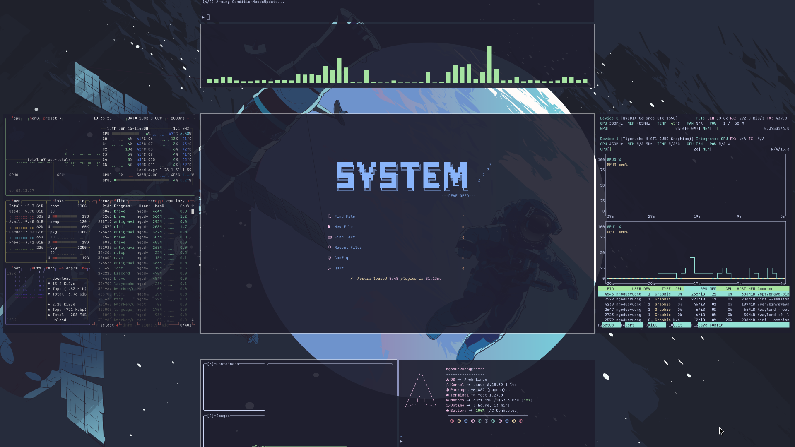

# vuongngo/dotfiles

**My Arch Linux dotfiles** — managed with GNU Stow for reproducibility and modularity.

Focused on a clean, productive, and reliable daily driver using **Niri** (primary) and **Hyprland** (secondary) on Arch Linux.

## 🖼️ Previews

### Niri (Primary Window Manager)

<div align="center">
  
  <p><em>Scrollable tiling Wayland compositor with clean interface</em></p>
</div>

### Hyprland (Secondary Window Manager)

<div align="center">
  
  <p><em>Feature-rich Wayland compositor with dynamic tiling</em></p>
</div>

## 🚀 Quick Usage

### Prerequisites
- **Arch Linux** with base system installed
- **Git**, **GNU Stow**
- **Basic packages**: zsh, neovim, rofi, waybar, etc.

### Installation
1. **Clone the repository**:
   ```bash
   git clone https://github.com/vuongngo/dotfiles.git
   cd dotfiles
   ```
2. **Stow configurations**:
   ```bash
   stow .config niri # For Niri (primary)
   # Or: stow .config hyprland # For Hyprland
   ```
3. **Run setup scripts**:
   ```bash
   ./install/install_zsh.sh     # Configure Zsh shell
   ./install/install_niri.sh    # Install Niri WM
   ```

### Daily Usage Tips
- **Fast application launch**: `Super` + `D` (rofi launcher)
- **Terminal**: `Super` + `T` (opens foot terminal by default)
- **Switch apps**: `Super` + `Tab` or `Alt` + `Tab`
- **Switch window managers**: 
   ```bash
   stow -D niri
   stow hyprland
   ```

## 📚 Documentation

For detailed information, please refer to the following documents:
- [FEATURES.md](FEATURES.md) - Tech stack, features, and repository structure
- [INSTALLATION.md](INSTALLATION.md) - Detailed installation guide and troubleshooting
- [CONFIGURATIONS.md](CONFIGURATIONS.md) - Comprehensive configuration details
- [CONTRIBUTING.md](CONTRIBUTING.md) - Contribution guidelines and project purpose

---

**Last Updated**: March 2026 | **OS**: Arch Linux | **Primary WM**: Niri
